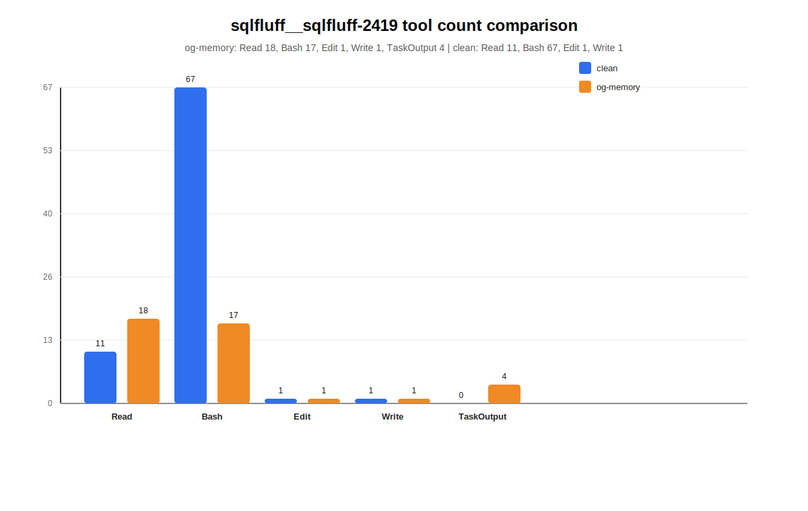
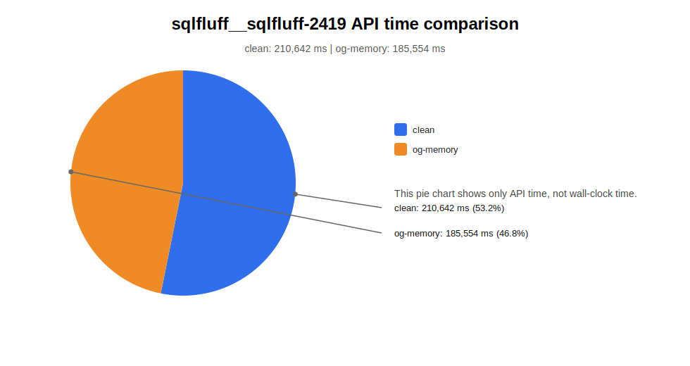

# sqlfluff__sqlfluff-2419 对比报告

下面是同一个 SWE-bench Lite 任务在两个环境下的对比：

- `clean`：不接 MCP 的普通运行
- `og-memory`：接入 `og-memory` MCP 的运行

## 图表

### 工具调用次数对比

### API 时间对比

## 结论

这个任务本身是 SQLFluff 的 `L060` 规则修复，核心目标是让报错信息更具体：

- `IFNULL` 要显示成 `Use 'COALESCE' instead of 'IFNULL'.`
- `NVL` 要显示成 `Use 'COALESCE' instead of 'NVL'.`

从图上看，最明显的差别是：

- `og-memory` 的工具调用次数更少，尤其是 `Bash` 明显少很多
- `og-memory` 的 API 时间也更低
- 这说明接入 `og-memory` 后，这次任务的执行更细

## 具体数字

### clean

- `Read`: 11
- `Bash`: 67
- `Edit`: 1
- `Write`: 1

### og-memory

- `Read`: 18
- `Bash`: 17
- `Edit`: 1
- `Write`: 1
- `TaskOutput`: 4

### API time

- `clean`: `210,642 ms`
- `og-memory`: `185,554 ms`

## 结论

> 在这个任务上，`og-memory` 没有改变最终修复目标，但它让运行过程更省操作，也更省 API 时间。

